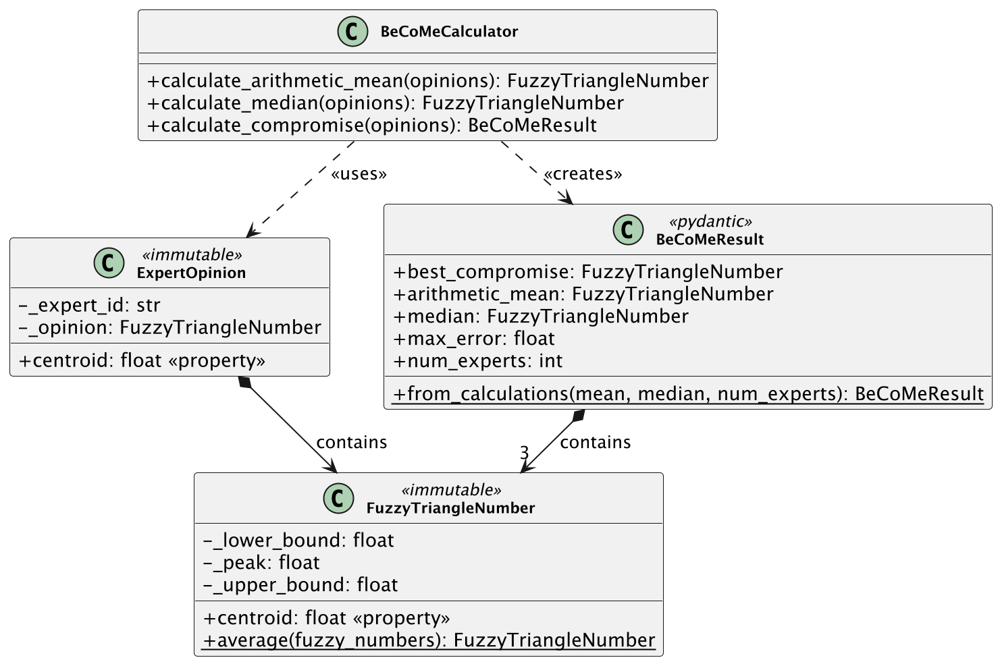

# BeCoMe

Full-stack web application for group decision-making under fuzzy uncertainty using the BeCoMe (Best Compromise Mean) method.

**Live: [becomify.app](https://www.becomify.app)**


## Table of contents

- [About](#about)
- [Abstract](#abstract)
- [Features](#features)
- [Quick start](#quick-start)
- [Web application](#web-application)
- [Methodology](#methodology)
- [Installation](#installation)
- [Project structure](#project-structure)
- [Testing](#testing)
- [Documentation](#documentation)
- [License](#license)
- [References](#references)

## About

A Python implementation of the **BeCoMe** (Best Compromise Mean) group decision-making method introduced by Vrana, Tyrychtr, and Pelikán (2021), packaged as a reusable library and a full-stack web application.

- **Author**: Ekaterina Kuzmina
- **University**: Czech University of Life Sciences Prague
- **Source method**: Vrana et al. (2021), *Environmental Modelling & Software* (see [References](#references))
- **Language**: English

## Abstract

**BeCoMe** (Best Compromise Mean) is a group decision-making method that aggregates expert opinions expressed as fuzzy triangular numbers. This project implements the method in Python, as originally published by Vrana et al. (2021). It combines the arithmetic mean and the median to produce consensus estimates that balance central tendency against outlier resistance.

Validated on three Czech case studies: COVID-19 budget allocation, flood prevention, and cross-border travel policy. The results match the original Excel implementation to within 0.001, and the core library has 100% test coverage.

## Features

### Web application
- **REST API**: FastAPI backend with JWT authentication
- **React frontend**: TypeScript and Tailwind CSS
- **Project management**: create projects, invite experts, collect opinions
- **Live calculations**: BeCoMe re-aggregates whenever an expert submits an opinion
- **Multi-language**: English and Czech localization

### Core library
- **Fuzzy triangular numbers**: operations on TFN (a, c, b) with validation
- **BeCoMe algorithm**: arithmetic mean + median → best compromise
- **Strategy pattern**: handles odd and even expert counts for the median
- **Likert scale support**: ordinal data as a special case of fuzzy numbers

### Quality
- **Coverage**: 100% on the core library, 99% across the backend
- **Test count**: 1,786 backend tests and 1,037 frontend tests
- **Type safety**: mypy strict mode, TypeScript strict
- **Three case studies**: COVID-19 budget, flood prevention, cross-border travel

## Web application

The project includes a full-stack web application for collaborative decision-making.

### Architecture

| Component | Technology | Port |
|-----------|------------|------|
| Backend | FastAPI + SQLModel | 8000 |
| Frontend | React + Vite + Tailwind | 8080 |
| Database | SQLite (dev), PostgreSQL (prod) | n/a |

### Key features

- **User authentication**: JWT auth with rotating refresh tokens, delivered as HttpOnly session cookies with CSRF protection
- **Project management**: create projects with custom scales, invite experts by email
- **Opinion collection**: experts submit fuzzy triangular numbers (lower, peak, upper)
- **Automatic calculation**: the API recomputes the BeCoMe result on every opinion submitted
- **Role-based access**: admin and member roles per project

### Live application

**https://www.becomify.app**

### Local development

```bash
# Backend (http://localhost:8000)
uv sync --extra api
uv run uvicorn api.main:app --reload

# Frontend (http://localhost:8080)
cd frontend && npm install && npm run dev
```

See [api/README.md](api/README.md) for API documentation.

### Environment profiles

The backend selects a profile from the `APP_ENV` variable: `dev` (default), `test`, or `prod`. Settings load the shared `.env` first, then `.env.<APP_ENV>` on top, so the profile file overrides the base. `APP_ENV` is read from the process environment (shell, Docker, Railway, CI), not from the dotenv file, because it decides which file to load.

| Profile | APP_ENV | Use | Database | Debug |
|---------|---------|-----|----------|-------|
| dev | unset or `dev` | Local development | SQLite | on |
| test | `test` | Deployed staging and the test suite | PostgreSQL | off |
| prod | `prod` | Production (Railway) | PostgreSQL | off |

Copy the matching template and fill it in (the real files are gitignored):

```bash
cp .env.dev.example .env.dev      # local development
cp .env.test.example .env.test    # staging
cp .env.prod.example .env.prod    # production-like local run
```

Run a specific profile by exporting `APP_ENV`:

```bash
APP_ENV=dev uv run uvicorn api.main:app --reload
APP_ENV=prod uv run uvicorn api.main:app
```

Both deployed profiles (`test`, `prod`) refuse to start misconfigured: a weak or default `SECRET_KEY`, a SQLite `DATABASE_URL`, a missing `REDIS_URL`, or localhost-only `CORS_ORIGINS` fails startup immediately. Production also requires `CLOUDFLARE_ORIGIN_SECRET`.

The `TESTING` flag is separate from the profile. The test suite sets `APP_ENV=test` together with `TESTING=1`. `TESTING` disables rate limiting and the deploy startup checks, and it is never set on a deployed profile, so staging keeps the same limits as production.

On Railway, set the profile and secrets as service variables per environment: `APP_ENV`, `SECRET_KEY`, `DATABASE_URL`, `REDIS_URL`, `CORS_ORIGINS`, and `DEBUG`. The staging service uses `APP_ENV=test`, and production uses `APP_ENV=prod`. The frontend reads its API URL from `VITE_API_URL`, injected at build time (see the frontend Dockerfile), so staging and production differ only by that value.

See [docs/environments.md](docs/environments.md) for the full reference: per-profile details, Railway variables, and current deployment status.

## Methodology

### Method overview

The BeCoMe method operates on expert opinions expressed as fuzzy triangular numbers **A** = (a, c, b), where:
- **a** = lower bound (pessimistic estimate)
- **c** = peak (most likely value)
- **b** = upper bound (optimistic estimate)

The algorithm proceeds through four steps:

1. **Arithmetic mean (Γ)**: average all expert opinions component-wise
2. **Median (Ω)**: sort opinions by centroid, then compute the median fuzzy number
3. **Best compromise (ΓΩMean)**: average the arithmetic mean and the median
4. **Error estimation (Δmax)**: compute the maximum deviation as a quality metric

### Implementation approach

**Programming language**: Python 3.13+

**Key design decisions**:
- Object-oriented architecture that separates the data models from the calculation logic
- Strategy pattern for the median calculation (an odd against an even number of experts)
- Immutable value objects for fuzzy numbers, built on `__slots__` and a blocked `__setattr__`
- `mypy` in strict mode enforces type safety
- Unit and integration tests, with the core library at 100% coverage

**Dependencies**:
- Core: `pydantic` for data validation (the only runtime dependency)
- Development: `pytest`, `mypy`, `ruff` (optional, via `--extra dev`)
- Visualization: `matplotlib`, `plotly`, `seaborn` (optional, via `--extra viz`)
- Notebooks: `jupyter`, `ipykernel` (optional, via `--extra notebook`)

**Validation**: results match the Excel reference calculations from the original research. All three case studies produce the expected values within a 0.001 tolerance.

## Data

### Case study datasets

The implementation includes three real-world datasets from the Czech public policy domain:

#### 1. Budget case (budget_case.txt)

COVID-19 pandemic budget support estimation. 22 experts (government officials, emergency service leaders) provided interval estimates in billions of CZK. Demonstrates median calculation with an even number of experts.

#### 2. Floods case (floods_case.txt)

Flood prevention planning: what percentage of arable land should be converted? 13 experts from different backgrounds (land owners, hydrologists, rescue services) show highly polarized opinions. This case demonstrates the median calculation with an odd expert count.

#### 3. Pendlers case (pendlers_case.txt)

Cross-border travel policy during the pandemic. 22 public health officials and border service representatives rated policy options on a Likert scale (0, 25, 50, 75, 100). It uses crisp values, the special case where a = c = b in fuzzy number notation.

### Data format

Every dataset lives in `examples/data/`, in a human-readable text format:

```
CASE: CaseName
DESCRIPTION: Case description
EXPERTS: N

# Format: ExpertID | Lower | Peak | Upper
Expert1 | 10.0 | 15.0 | 20.0
Expert2 | 12.0 | 18.0 | 25.0
...
```

### Data availability

- **Location**: the `examples/data/` directory in this repository
- **License**: academic and research use
- **Access**: public (GitHub repository)

## Quick start

### Web application

**Live demo:** https://www.becomify.app

Register, create a project, invite experts, and collect opinions. No installation required.

### Command line (case studies)

```bash
uv sync --extra dev
uv run python -m examples.analyze_budget_case
```

## Installation

### Requirements

- Python 3.13 or higher
- `uv` package manager (recommended) or `pip`

### Installation steps

This project uses `uv` for dependency management:

```bash
# Clone the repository
git clone <repository-url>
cd BeCoMe

# Install core dependencies only
uv sync

# Install with development tools (testing, linting, type checking)
uv sync --extra dev

# Install with visualization libraries (matplotlib, plotly, seaborn)
uv sync --extra viz

# Install with Jupyter notebook support
uv sync --extra notebook

# Install everything
uv sync --all-extras

# Activate virtual environment
source .venv/bin/activate  # On macOS/Linux
# or
.venv\Scripts\activate     # On Windows
```

After installing the `dev` extra, enable the local secret-scanning git hook:

```bash
uv run pre-commit install
```

### Dependency groups

| Group | Contents | Use case |
|-------|----------|----------|
| (core) | pydantic | Minimal installation for using the library |
| `api` | fastapi, uvicorn, sqlmodel, alembic, redis, boto3 | Running the REST API |
| `dev` | pytest, hypothesis, mypy, ruff, bandit, detect-secrets, pre-commit | Development, testing, security |
| `viz` | numpy, pandas, matplotlib, plotly, seaborn | Visualization and data analysis |
| `notebook` | jupyter, ipykernel, ipywidgets | Interactive notebooks |

Alternatively, with pip:

```bash
pip install -e ".[dev,viz,notebook]"
```

## Usage

### Running case study examples

To see what the BeCoMe method does, run one of the case study analyses:

```bash
# COVID-19 budget support case (22 experts, even number)
uv run python -m examples.analyze_budget_case

# Flood prevention case (13 experts, odd number)
uv run python -m examples.analyze_floods_case

# Cross-border travel policy case (22 experts, Likert scale)
uv run python -m examples.analyze_pendlers_case
```

Each example prints the calculation step by step, and explains each mathematical operation as it goes.

### Basic API usage

```python
from src.calculators.become_calculator import BeCoMeCalculator
from src.models.expert_opinion import ExpertOpinion
from src.models.fuzzy_number import FuzzyTriangleNumber

# Create expert opinions as fuzzy triangular numbers
experts = [
    ExpertOpinion("Expert 1", FuzzyTriangleNumber(5.0, 10.0, 15.0)),
    ExpertOpinion("Expert 2", FuzzyTriangleNumber(8.0, 12.0, 18.0)),
    ExpertOpinion("Expert 3", FuzzyTriangleNumber(6.0, 11.0, 16.0)),
]

# Calculate best compromise
calculator = BeCoMeCalculator()
result = calculator.calculate_compromise(experts)

# Access results
print(f"Best Compromise: {result.best_compromise}")
print(f"Arithmetic Mean: {result.arithmetic_mean}")
print(f"Median: {result.median}")
print(f"Max Error: {result.max_error}")
print(f"Number of Experts: {result.num_experts}")
```

See [src/README.md](src/README.md) for API documentation.

## Project structure

```text
BeCoMe/
├── api/                    # REST API (FastAPI)
│   ├── auth/                   # Authentication (JWT, passwords, session cookies, throttles)
│   ├── db/                     # Database models (SQLModel)
│   ├── middleware/             # Rate limit, CSRF, body size, security headers, logging
│   ├── routes/                 # HTTP endpoints
│   ├── schemas/                # Pydantic DTOs
│   ├── services/               # Business logic
│   └── README.md               # API documentation
├── frontend/               # Web UI (React + Vite)
│   ├── src/
│   │   ├── components/         # UI components (shadcn/ui)
│   │   ├── pages/              # Route pages
│   │   ├── contexts/           # React contexts
│   │   └── i18n/               # Translations (en, cs)
│   └── README.md
├── src/                    # Core library
│   ├── models/                 # Fuzzy number, expert opinion
│   ├── calculators/            # BeCoMe algorithm
│   └── interpreters/           # Likert scale support
├── tests/                  # Test suite (1,786 backend tests)
│   ├── unit/                   # Unit tests (models, calculators, API)
│   ├── integration/            # Integration tests (Excel validation, API routes, DB)
│   ├── e2e/                    # End-to-end API tests
│   └── reference/              # Expected values from Excel
├── examples/               # Case study examples
│   └── data/                   # Dataset files
└── docs/                   # Documentation
```

## Testing

### Running tests

```bash
# Run all tests
uv run pytest

# Run with coverage report
uv run pytest --cov=src --cov-report=term-missing

# Run specific test categories
uv run pytest tests/unit/              # Unit tests only
uv run pytest tests/integration/       # Integration tests only
uv run pytest tests/unit/models/       # Model tests only
```

### Test coverage

Current test coverage: **100%** on the core library (`src/`) and **99%** across the backend overall. Most of the remaining lines are Redis-backed store variants, which run against a live Redis rather than in the unit suite.

The backend has 1,215 unit tests (models, calculators, interpreters, utilities, API) and 512 integration tests (Excel validation, API routes, database). Another 59 end-to-end tests cover full API workflows. The frontend adds 1,037 Vitest tests and 223 Playwright runs across five browser projects. The suite covers the edge cases: a single expert, identical opinions, and extreme values. Property-based tests built on Hypothesis check fuzzy number arithmetic.

To regenerate these counts, run `uv run pytest tests/unit/ --collect-only -q` for each backend tier, `npx vitest run` in `frontend/`, and `npx playwright test --list`.

See the [quality report](docs/quality-report.md) for detailed metrics.

## Code quality

The project holds to strict code quality standards:

```bash
# Type checking with mypy (strict mode)
uv run mypy src/ examples/

# Linting with ruff
uv run ruff check .

# Code formatting
uv run ruff format .

# Run all quality checks
uv run mypy src/ examples/ && uv run ruff check . && uv run pytest --cov=src
```

All code passes mypy in strict mode. The one `type: ignore` in the tree sits on `src/models/become_result.py:52`, where mypy and Pydantic's `@computed_field` decorator disagree about the property type. Ruff enforces consistent style, and every public API has docstrings.

## Documentation

Documentation is available in the `docs/` directory:

| Document | Description |
|----------|-------------|
| [Method description](docs/method-description.md) | Mathematical foundation with formulas and worked examples |
| [UML diagrams](docs/uml-diagrams/README.md) | Visual architecture (class, sequence, and activity diagrams) |
| [Quality report](docs/quality-report.md) | Code quality metrics and test coverage details |
| [Security](docs/security.md) | Application and database security posture |
| [Environments](docs/environments.md) | The dev, test, and prod profiles, and Railway deployment |
| [Source code](src/README.md) | API documentation and module descriptions |

## Architecture

The implementation follows object-oriented design principles:

### Class diagram



*The sequence and activity diagrams live in the [UML documentation](docs/uml-diagrams/README.md).*

### Design patterns

`FuzzyTriangleNumber` is a value object: immutable, and validated on construction. The median calculation uses the Strategy pattern to handle odd and even expert counts differently. `BaseAggregationCalculator` applies Template Method for the calculation skeleton, and `BeCoMeResult` is the DTO that carries all the outputs.

## Examples

The `examples/` directory contains three real-world case studies demonstrating the method:

### Budget case (22 experts)

Government officials and emergency service leaders estimated COVID-19 budget support needs (0-100 billion CZK). With an even number of experts, this case shows how the median is calculated by averaging two middle values.

### Floods case (13 experts)

Land owners, hydrologists, and rescue coordinators disagreed strongly on flood prevention measures. The polarized opinions make this case the interesting one: it demonstrates how BeCoMe handles outliers when the expert count is odd.

### Pendlers case (22 experts)

Public health officials rated cross-border travel policies on a Likert scale. Unlike the other cases, this one uses crisp values, where a = c = b. It shows that fuzzy numbers generalize ordinal scales.

Running any example loads data from `examples/data/`, walks through the calculation step by step, and shows intermediate results (arithmetic mean, median, sorting process). The output includes interpretation of the final consensus estimate.

See [examples/README.md](examples/README.md) for details.

## License

**Academic use**: this code is provided for academic and research purposes. If you build on this implementation, cite the original BeCoMe paper by Vrana et al. (2021), listed under [References](#references).

**Copyright**: © 2025-2026 Ekaterina Kuzmina

## Contact

For questions or collaboration inquiries:

- **Author**: Ekaterina Kuzmina
- **Email**: xkuze010@studenti.czu.cz
- **University**: Czech University of Life Sciences Prague

## References

### Source method

This project implements the BeCoMe method developed by I. Vrana, J. Tyrychtr, and M. Pelikán at the Faculty of Economics and Management, Czech University of Life Sciences Prague.

**Key reference:**
- Vrana, I., Tyrychtr, J., & Pelikán, M. (2021). BeCoMe: Easy-to-implement optimized method for best-compromise group decision making: Flood-prevention and COVID-19 case studies. *Environmental Modelling & Software*, 136, 104953. https://doi.org/10.1016/j.envsoft.2020.104953

Foundational background: fuzzy logic (Zadeh 1965, and Bellman & Zadeh 1970).

### Project report

A detailed write-up of the implementation is available in [thesis/main.pdf](thesis/main.pdf).

### Datasets

All case study data is in `examples/data/`. The Budget case has 22 experts estimating COVID-19 support. The Floods case involves 13 experts with polarized views on land reduction. The Pendlers case uses Likert scale ratings from 22 officials on cross-border travel policy.

See [examples/data/README.md](examples/data/README.md) for format specifications and data provenance.

## Acknowledgments

Thanks to the authors of the BeCoMe method, I. Vrana, J. Tyrychtr, and M. Pelikán, at the Faculty of Economics and Management, Czech University of Life Sciences Prague.
