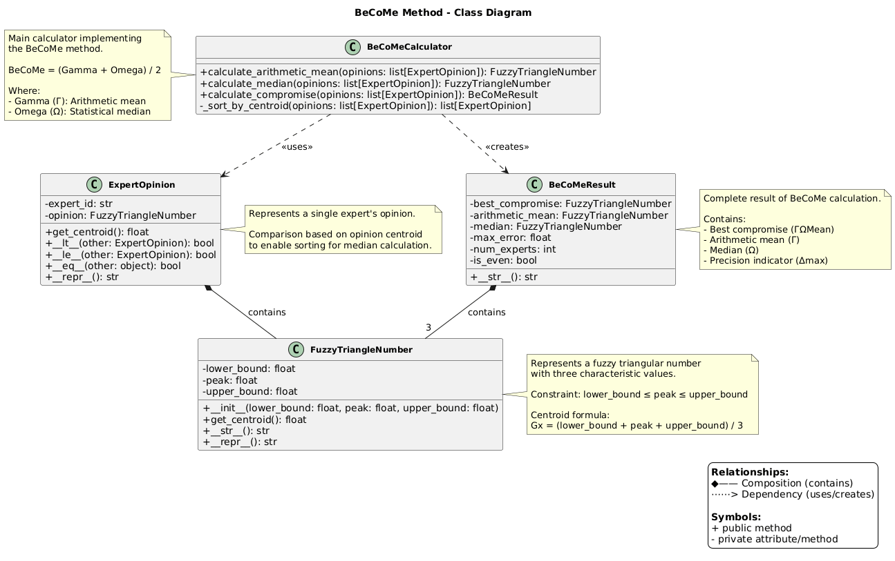
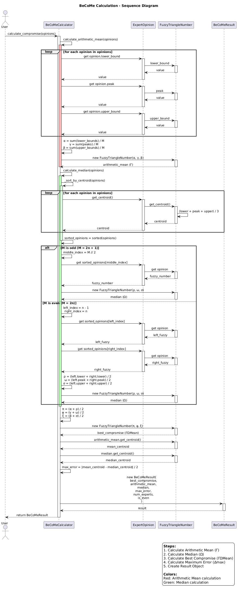

# UML Diagrams

This document contains UML diagrams that visualize the architecture and behavior of the BeCoMe (Best Compromise Mean) implementation.

## Overview

The BeCoMe implementation consists of several key components working together to aggregate expert opinions expressed as fuzzy triangular numbers. The following diagrams illustrate:

1. **Class Diagram** - Static structure and relationships between classes
2. **Sequence Diagram** - Dynamic behavior during calculation process
3. **Activity Diagram** - Algorithm flow and decision logic

---

## 1. Class Diagram

The class diagram shows the static structure of the BeCoMe implementation, including all classes, their attributes, methods, and relationships.



### Key Components

#### FuzzyTriangleNumber
Represents a fuzzy triangular number with three characteristic values:
- `lower_bound` (A) - minimum possible value
- `peak` (C) - most likely value
- `upper_bound` (B) - maximum possible value

**Key method:**
- `get_centroid()` - calculates the center of gravity: `Gx = (A + C + B) / 3`

**Constraint:** `lower_bound ≤ peak ≤ upper_bound`

#### ExpertOpinion
Represents a single expert's opinion composed of:
- `expert_id` - unique identifier for the expert
- `opinion` - FuzzyTriangleNumber representing the expert's assessment

**Key features:**
- Implements comparison operators (`__lt__`, `__le__`, `__eq__`) based on centroid
- Enables sorting of expert opinions for median calculation
- Delegates centroid calculation to the contained FuzzyTriangleNumber

#### BeCoMeCalculator
Main calculator implementing the BeCoMe method with three public methods:

1. **`calculate_arithmetic_mean(opinions)`**
   - Calculates Γ(α, γ, β) - arithmetic mean of all expert opinions
   - Formula: `α = (1/M) × Σ(Aₖ)`, `γ = (1/M) × Σ(Cₖ)`, `β = (1/M) × Σ(Bₖ)`

2. **`calculate_median(opinions)`**
   - Calculates Ω(ρ, ω, σ) - statistical median of all expert opinions
   - For odd M: takes middle element after sorting by centroid
   - For even M: averages two middle elements

3. **`calculate_compromise(opinions)`**
   - Main method that orchestrates the entire calculation
   - Returns BeCoMeResult with all intermediate and final values

**Private helper:**
- `_sort_by_centroid(opinions)` - sorts opinions by centroid for median calculation

#### BeCoMeResult
Pydantic model containing complete calculation results:
- `best_compromise` - ΓΩMean(π, φ, ξ) - final best compromise
- `arithmetic_mean` - Γ(α, γ, β) - arithmetic mean
- `median` - Ω(ρ, ω, σ) - statistical median
- `max_error` - Δmax - precision indicator
- `num_experts` - number of expert opinions
- `is_even` - whether number of experts is even

### Relationships

- **Composition** (◆——): ExpertOpinion *contains* FuzzyTriangleNumber; BeCoMeResult *contains* three FuzzyTriangleNumber instances
- **Dependency** (⋯⋯>): BeCoMeCalculator *uses* ExpertOpinion and *creates* BeCoMeResult

---

## 2. Sequence Diagram

The sequence diagram illustrates the dynamic interaction between objects during a BeCoMe calculation, showing the message flow and timing of operations.



### Calculation Flow

The sequence diagram shows the five main steps of BeCoMe calculation:

#### Step 1: Calculate Arithmetic Mean (Γ) [Red]
1. Calculator receives list of expert opinions
2. For each opinion, extract `lower_bound`, `peak`, `upper_bound`
3. Calculate averages: `α = Σ(lower) / M`, `γ = Σ(peak) / M`, `β = Σ(upper) / M`
4. Create FuzzyTriangleNumber(α, γ, β) as arithmetic mean

#### Step 2: Calculate Median (Ω) [Green]
1. For each opinion, calculate centroid: `(lower + peak + upper) / 3`
2. Sort opinions by centroid values (ascending)
3. **If M is odd:**
   - Find middle element at index `M // 2`
   - Use its components as median: `Ω(ρ, ω, σ)`
4. **If M is even:**
   - Find two middle elements at indices `n-1` and `n`
   - Average their components: `ρ = (left.lower + right.lower) / 2`, etc.
5. Create FuzzyTriangleNumber(ρ, ω, σ) as median

#### Step 3: Calculate Best Compromise
1. Average arithmetic mean and median: `π = (α + ρ) / 2`, `φ = (γ + ω) / 2`, `ξ = (β + σ) / 2`
2. Create FuzzyTriangleNumber(π, φ, ξ) as best compromise

#### Step 4: Calculate Maximum Error
1. Get centroid of arithmetic mean
2. Get centroid of median
3. Calculate: `Δmax = |mean_centroid - median_centroid| / 2`

#### Step 5: Create Result
1. Construct BeCoMeResult with all calculated values
2. Return result to user

### Key Observations

- **Modularity**: Each calculation step is clearly separated
- **Reusability**: Centroid calculation is used multiple times
- **Branching logic**: Median calculation differs for odd/even number of experts
- **Immutability**: New FuzzyTriangleNumber instances are created rather than modified

---

## 3. Activity Diagram

The activity diagram shows the algorithmic flow of the BeCoMe method, including decision points and parallel processing.


### Algorithm Workflow

The activity diagram is organized into five color-coded partitions:

#### Partition 1: Arithmetic Mean (Γ) [Red Background]
**Input:** List of M expert opinions

**Process:**
1. Initialize sums for lower bounds, peaks, and upper bounds
2. Iterate through all opinions, accumulating sums
3. Calculate averages: `α = sum_lower / M`, `γ = sum_peak / M`, `β = sum_upper / M`
4. Create Γ as FuzzyTriangleNumber(α, γ, β)

**Output:** Arithmetic mean Γ(α, γ, β)

#### Partition 2: Median (Ω) [Green Background]
**Input:** List of M expert opinions

**Process:**
1. Calculate centroid for each opinion: `Gx = (lower + peak + upper) / 3`
2. Sort opinions by centroid values in ascending order
3. **Decision point:** Is M odd or even?
   - **If M is odd (M = 2n + 1):**
     - Find middle index: `middle_index = M // 2`
     - Extract middle opinion's components as median
   - **If M is even (M = 2n):**
     - Find two middle indices: `left_index = n-1`, `right_index = n`
     - Average the two middle opinions' components
4. Create Ω as FuzzyTriangleNumber(ρ, ω, σ)

**Output:** Median Ω(ρ, ω, σ)

#### Partition 3: Best Compromise (ΓΩMean) [Blue Background]
**Input:** Arithmetic mean Γ and median Ω

**Process:**
1. Calculate compromise for each component:
   - `π = (α + ρ) / 2`
   - `φ = (γ + ω) / 2`
   - `ξ = (β + σ) / 2`
2. Create ΓΩMean as FuzzyTriangleNumber(π, φ, ξ)

**Output:** Best compromise ΓΩMean(π, φ, ξ)

**Formula:** `ΓΩMean = (Γ + Ω) / 2`

#### Partition 4: Maximum Error (Δmax) [Yellow Background]
**Input:** Arithmetic mean Γ and median Ω

**Process:**
1. Calculate centroid of arithmetic mean: `mean_centroid = Γ.get_centroid()`
2. Calculate centroid of median: `median_centroid = Ω.get_centroid()`
3. Calculate maximum error: `Δmax = |mean_centroid - median_centroid| / 2`

**Output:** Precision indicator Δmax

**Interpretation:** Smaller Δmax indicates higher agreement among experts

#### Partition 5: Result Creation
**Input:** All calculated values

**Process:**
1. Create BeCoMeResult object with:
   - `best_compromise = ΓΩMean`
   - `arithmetic_mean = Γ`
   - `median = Ω`
   - `max_error = Δmax`
   - `num_experts = M`
   - `is_even = (M % 2 == 0)`
2. Return BeCoMeResult

**Output:** Complete BeCoMeResult object

### Key Decision Points

1. **Empty list validation:** Before processing, check if opinions list is empty → raise ValueError
2. **Odd vs. Even experts:** Median calculation branches based on whether M is odd or even

### Key Formulas (from Legend)

**Arithmetic Mean (Γ):**
```
α = (1/M) × Σ(Aₖ)
γ = (1/M) × Σ(Cₖ)
β = (1/M) × Σ(Bₖ)
```

**Best Compromise (ΓΩMean):**
```
π = (α + ρ) / 2
φ = (γ + ω) / 2
ξ = (β + σ) / 2
```

**Maximum Error:**
```
Δmax = |centroid(Γ) - centroid(Ω)| / 2
```

---

## Generating Diagrams

All diagrams are generated from PlantUML source files (`.puml`) located in `docs/uml-diagrams/`.

### Regenerate All Diagrams

To regenerate PNG images from PlantUML sources:

```bash
# Activate virtual environment
source .venv/bin/activate  # macOS/Linux
# or
.venv\Scripts\activate     # Windows

# Run generation script
python docs/generate_diagrams.py
```

This will generate:
- `class-diagram.png`
- `sequence-diagram.png`
- `activity-diagram.png`

### Requirements

- Python 3.13+
- `plantuml` package (installed via `pyproject.toml`)
- Internet connection (uses PlantUML online service)

### Source Files

- `docs/uml-diagrams/class-diagram.puml` - Class diagram source
- `docs/uml-diagrams/sequence-diagram.puml` - Sequence diagram source
- `docs/uml-diagrams/activity-diagram.puml` - Activity diagram source

---

## Understanding the BeCoMe Method

These diagrams complement the mathematical description in `method-description.md` by providing visual representation of:

1. **Structure** (Class Diagram): What components exist and how they relate
2. **Behavior** (Sequence Diagram): How components interact during execution
3. **Algorithm** (Activity Diagram): What steps are performed and in what order

For detailed mathematical formulas and theoretical background, see:
- `docs/method-description.md` - Mathematical foundation
- `README.md` - Project overview and examples
- `supplementary/article.tex` - Original BeCoMe paper

---

## References

**PlantUML Syntax:**
- [PlantUML Class Diagrams](https://plantuml.com/class-diagram)
- [PlantUML Sequence Diagrams](https://plantuml.com/sequence-diagram)
- [PlantUML Activity Diagrams](https://plantuml.com/activity-diagram-beta)

**BeCoMe Method:**
- Vrana, I., Tyrychtr, J., & Pelikan, M. (2021). BeCoMe – A new approach for fuzzy group decision making. Expert Systems with Applications.

---

*Last updated: 2025-10-10*  
*Generated with PlantUML via online service*
