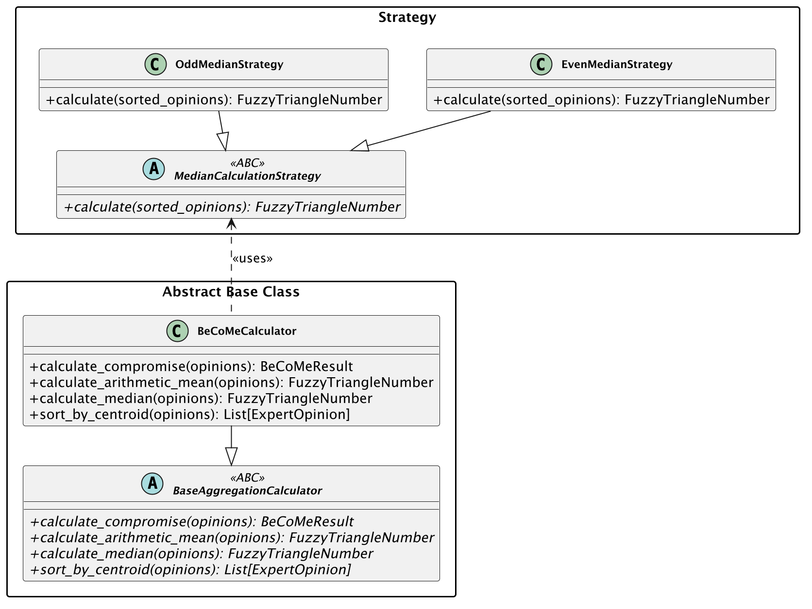
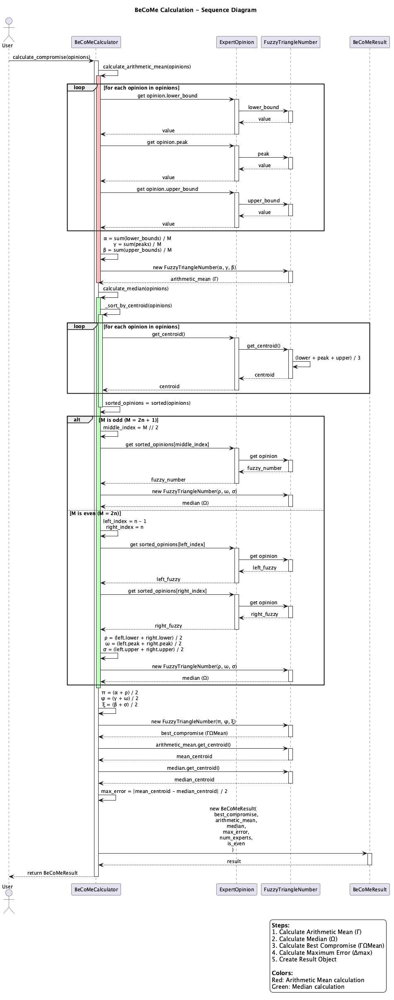
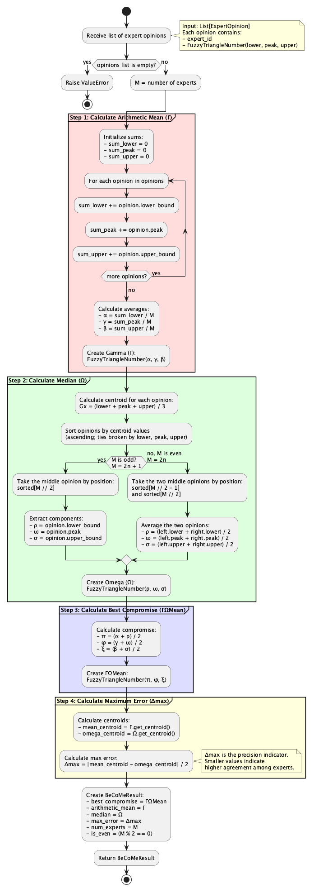
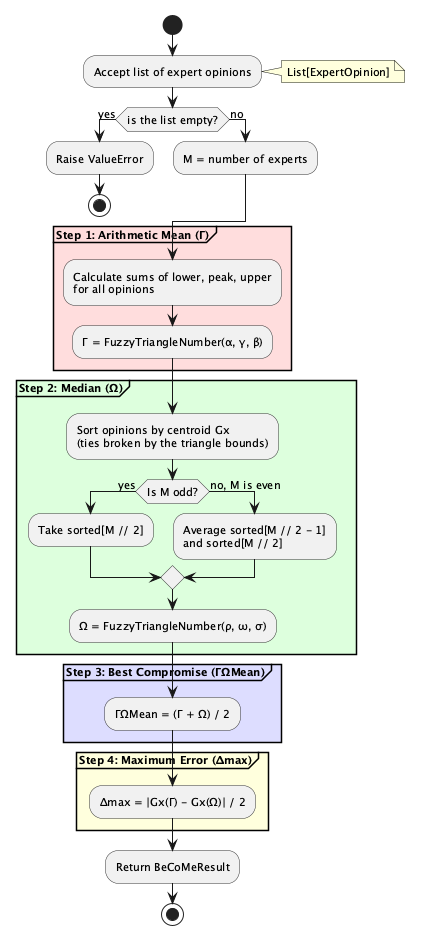

# UML diagrams

Five diagrams visualize the BeCoMe implementation from different angles.

## Class diagram


Static structure of the codebase. `FuzzyTriangleNumber` holds three floats (lower bound, peak, upper bound) and calculates its centroid. `ExpertOpinion` wraps an expert ID with their fuzzy assessment. Comparison operators use the centroid, which is what makes the opinions sortable for the median.

`BeCoMeCalculator` does the actual work: arithmetic mean, median, and the combined compromise. Results go into `BeCoMeResult`, a Pydantic model with the final fuzzy number plus intermediate values and error metric.

Composition arrows show containment (ExpertOpinion contains FuzzyTriangleNumber). Dashed arrows show dependencies (calculator uses opinions, creates results).

## Class diagram: patterns



The same classes seen through the two structures that shape them. `MedianCalculationStrategy` has one concrete subclass per parity: `OddMedianStrategy` takes the middle opinion, `EvenMedianStrategy` averages the two around the middle, and `BeCoMeCalculator` picks between them at run time instead of branching inline.

`BaseAggregationCalculator` is the abstract side. All four of its methods are abstract and it sequences none of them, so what it fixes is the interface any second aggregation method would have to meet, not a shared implementation.

## Sequence diagram



Message flow during `calculate_compromise()`. The calculator first loops through opinions to compute the arithmetic mean: it averages lower bounds, peaks, and upper bounds separately. Then it sorts opinions by centroid and picks the middle element (or averages two middle elements for even counts).

With both Γ and Ω computed, the calculator averages them component-wise to get ΓΩMean. Maximum error is half the distance between mean and median centroids. Everything gets packed into BeCoMeResult and returned.

## Activity diagram



Algorithm flow with decision points. The odd/even branch in median calculation is the main fork: odd counts take the middle element directly, even counts average two neighbors. Color-coded partitions separate the four calculation phases: mean (red), median (green), compromise (blue), error (yellow).

## Activity diagram: simplified



The same flow as above with the per-component arithmetic collapsed into one step per phase. Read this one first, and the full version when you need the exact operations.

## Regenerating diagrams

Source files live in `diagrams/puml/`. To regenerate PNGs:

```bash
uv run python docs/uml-diagrams/generate_diagrams.py
```

Requires `plantuml` CLI installed locally (`brew install plantuml`).

## Related

- [Method description](../method-description.md): mathematical formulas
- [Source code](../../src/README.md): implementation details
