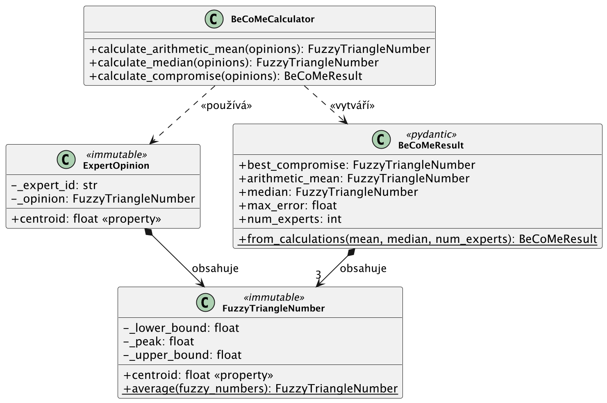
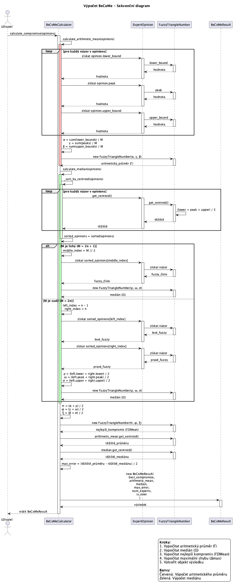
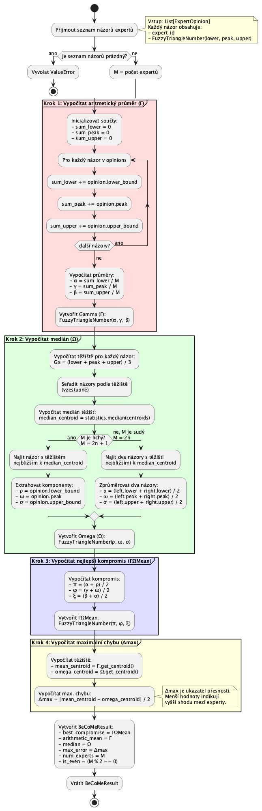

# UML Diagramy

Tři diagramy vizualizují implementaci BeCoMe z různých úhlů pohledu.

## Diagram tříd



Statická struktura kódu. `FuzzyTriangleNumber` obsahuje tři float hodnoty (dolní mez, vrchol, horní mez) a vypočítává své těžiště. `ExpertOpinion` obaluje ID experta s jeho fuzzy hodnocením — porovnávací operátory používají těžiště, což umožňuje řazení pro výpočet mediánu.

`BeCoMeCalculator` provádí vlastní práci: aritmetický průměr, medián a kombinovaný kompromis. Výsledky jsou uloženy do `BeCoMeResult`, Pydantic modelu s výsledným fuzzy číslem plus mezivýsledky a metrikou chyby.

Šipky kompozice ukazují obsahování (ExpertOpinion obsahuje FuzzyTriangleNumber). Přerušované šipky ukazují závislosti (kalkulátor používá názory, vytváří výsledky).

## Sekvenční diagram



Tok zpráv během `calculate_compromise()`. Kalkulátor nejprve prochází názory pro výpočet aritmetického průměru — průměruje dolní meze, vrcholy a horní meze samostatně. Poté řadí názory podle těžiště a vybírá střední prvek (nebo průměruje dva střední prvky pro sudé počty).

S oběma vypočítanými Γ a Ω kalkulátor průměruje jejich komponenty pro získání ΓΩMean. Maximální chyba je poloviční vzdálenost mezi těžištěm průměru a mediánu. Vše je zabaleno do BeCoMeResult a vráceno.

## Diagram aktivit



Tok algoritmu s rozhodovacími body. Větev lichý/sudý ve výpočtu mediánu je hlavní rozvětvení — liché počty berou střední prvek přímo, sudé počty průměrují dva sousedy. Barevně odlišené oddíly oddělují čtyři fáze výpočtu: průměr (červená), medián (zelená), kompromis (modrá), chyba (žlutá).

## Regenerace diagramů

Zdrojové soubory jsou v `diagrams/puml/`. Pro regeneraci PNG:

```bash
uv run python docs/uml-diagrams/generate_diagrams.py
```

Vyžaduje balíček `plantuml` a připojení k internetu (používá online službu PlantUML).

## Související

- [Popis metody](../method-description.md) — matematické vzorce
- [Zdrojový kód](../../src/README.md) — detaily implementace
