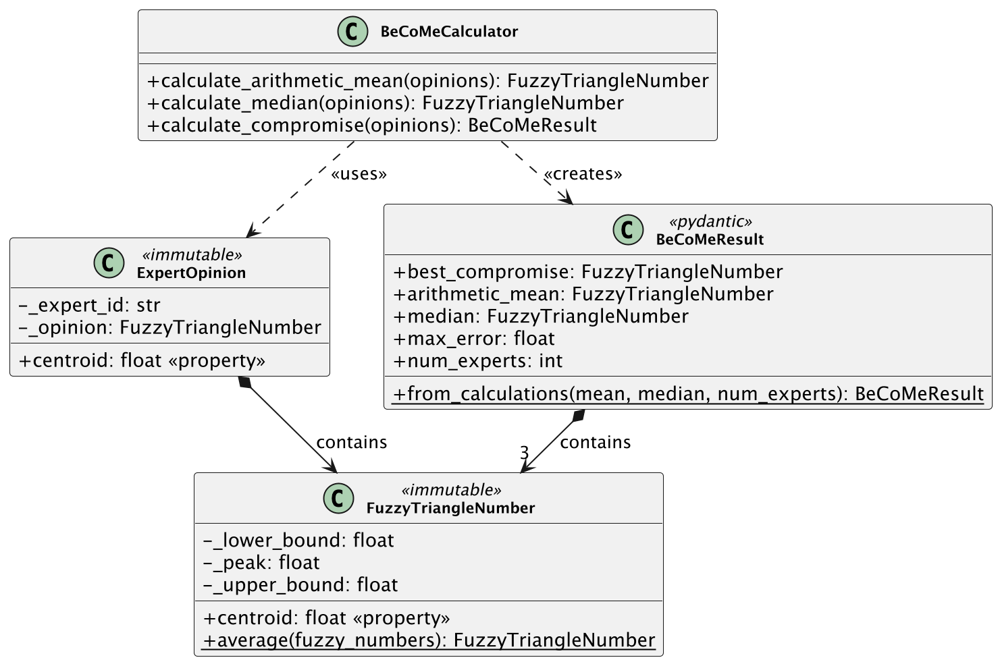
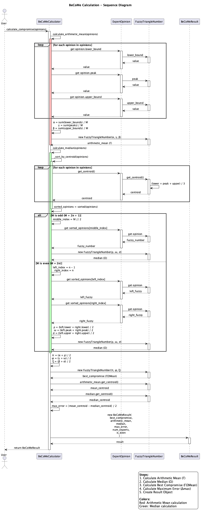
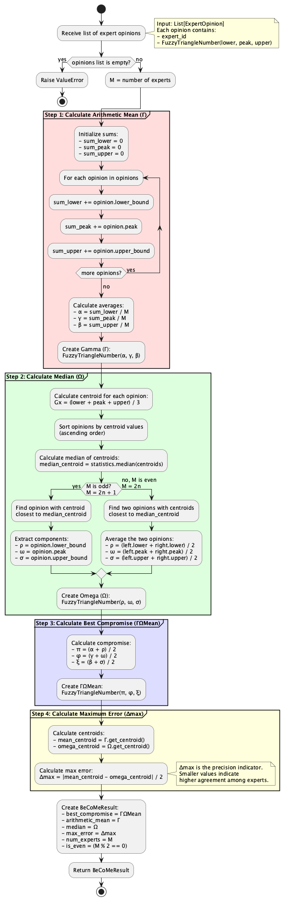

# UML Diagrams

Three diagrams visualize the BeCoMe implementation from different angles.

## Class Diagram



Static structure of the codebase. `FuzzyTriangleNumber` holds three floats (lower bound, peak, upper bound) and calculates its centroid. `ExpertOpinion` wraps an expert ID with their fuzzy assessment — comparison operators use the centroid, which enables sorting for median calculation.

`BeCoMeCalculator` does the actual work: arithmetic mean, median, and the combined compromise. Results go into `BeCoMeResult`, a Pydantic model with the final fuzzy number plus intermediate values and error metric.

Composition arrows show containment (ExpertOpinion contains FuzzyTriangleNumber). Dashed arrows show dependencies (calculator uses opinions, creates results).

## Sequence Diagram



Message flow during `calculate_compromise()`. The calculator first loops through opinions to compute arithmetic mean — averaging lower bounds, peaks, and upper bounds separately. Then it sorts opinions by centroid and picks the middle element (or averages two middle elements for even counts).

With both Γ and Ω computed, the calculator averages them component-wise to get ΓΩMean. Maximum error is half the distance between mean and median centroids. Everything gets packed into BeCoMeResult and returned.

## Activity Diagram



Algorithm flow with decision points. The odd/even branch in median calculation is the main fork — odd counts take the middle element directly, even counts average two neighbors. Color-coded partitions separate the four calculation phases: mean (red), median (green), compromise (blue), error (yellow).

## Regenerating Diagrams

Source files live in `diagrams/puml/`. To regenerate PNGs:

```bash
uv run python docs/uml-diagrams/generate_diagrams.py
```

Requires `plantuml` package and internet connection (uses PlantUML online service).

## Related

- [Method description](../method-description.md) — mathematical formulas
- [Source code](../../src/README.md) — implementation details
