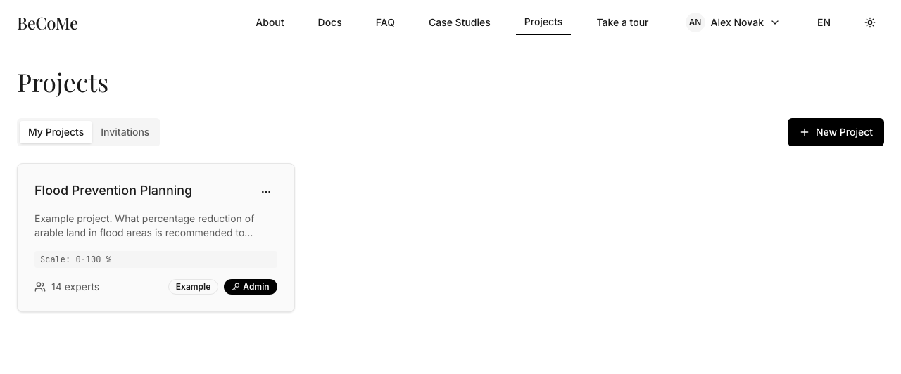
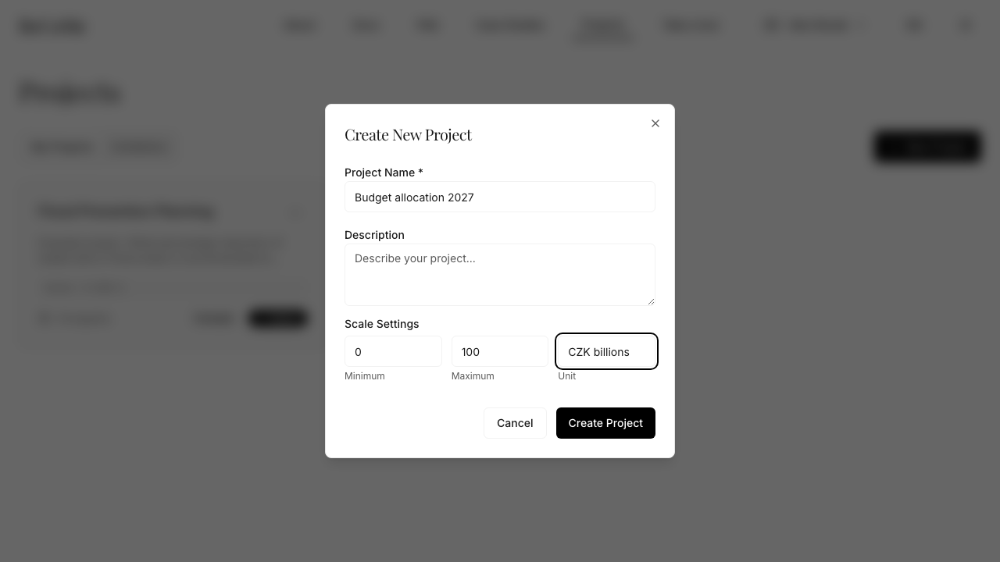

# Getting started

You need an account, a question, a scale, and some experts. This page covers all four. It takes
about ten minutes, and the first five of those are already done for you.

## Your account comes with a worked example

Register at [becomify.app](https://www.becomify.app), confirm the link that arrives by email, and
sign in. Your projects list will not be empty: every new account receives an example project with
thirteen real expert opinions already in it, drawn from a Czech flood prevention panel.

Open it before you create anything of your own. It is finished work, so you can see what the result
looks like and what the chart is telling you without first having to produce a panel. The
[worked example](worked-example.md) walks through the same numbers in detail.

The example project is read-only in the ways that matter. You cannot invite experts into it, and
that is deliberate: it exists so that everyone's copy tells the same story.

## Create a project

A project is one question put to one panel. Click **New Project** and fill in four things.

The **name** and **description** are for the experts, not for you. They are the whole briefing.
An expert opens the invitation, reads these two fields, and answers. If the description does not
say what is being asked, you will get answers to different questions and no amount of aggregation
will fix that.

The **scale** is the range the answer lives in, and it is the field people get wrong. Set the
minimum, the maximum, and the unit: `0` to `100` with unit `%`, or `0` to `200` with unit
`CZK billions`. The scale is not a guess at the answer. It is the boundary of what an answer could
possibly be, and every opinion has to fit inside it.

!!! warning "The agreement mode is not usable yet"

    The method has a second mode for "should we" questions, on a scale of 0 to 100 with no unit.
    The form below will not accept a project without a unit, and even a project that had one would
    not display its verdict. [Reading the result](reading-the-result.md) says where it stands.

## Invite the experts

Open the project and click **Invite Experts**. You invite by email address, and the address has to
belong to someone who already has an account. There is no invitation to a stranger: the person
signs up first, then you invite them.

They will find the invitation in their **Invitations** tab. Until they accept it they are not on
the panel and their absence does not hold anything up.

## What happens next

Nothing, until the experts answer. The result appears once opinions arrive, and it updates as more
of them do, so an early result is a real result for the experts who have answered so far. Watching
it move as the panel fills in is often more informative than the final number.

Next: [running a decision](running-a-decision.md), which covers the three ways an expert can
express an opinion.
