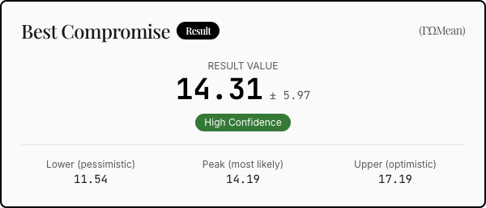
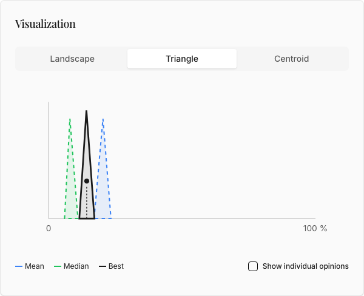

# Reading the result

You get four numbers and a chart. Three of the numbers are candidate answers and the fourth tells
you how much to trust them.

## The four figures

**Best compromise (ΓΩMean)** is the answer, and it is precisely the midpoint of the other two:
each of its three components is the average of the mean's and the median's. It refuses to choose
between them. This is the figure to quote.

**Arithmetic mean (Γ)** averages the opinions component by component: all the lower bounds
together, all the peaks together, all the upper bounds together. It uses every opinion, which is
its virtue and its flaw. One expert at an extreme drags it.

**Median (Ω)** sorts the opinions by centroid and takes the middle one. It ignores how far out the
extremes are, so an outlier cannot drag it. That is its virtue, and its flaw is the same: it also
ignores a genuine minority.

**Maximum error (Δmax)** is not an error in your data. It is the distance between the centers of
the mean and the median, halved, which is also exactly how far the compromise had to travel from
each of them. When the panel agrees, both land in the same place and Δmax is near zero. When the
panel splits, the two diverge and Δmax is the price of reconciling them.

Δmax is read against your scale, never on its own, and the app does that for you. It divides Δmax
by the width of the scale and labels the result: up to 20 percent is high agreement, up to 40 is
moderate, beyond that is low. A Δmax of 6 is 6 percent of a 0 to 100 scale and 0.06 percent of a 0
to 10000 one, and those are not the same finding.

Now the part that catches people, including me. **A small Δmax does not mean the panel agreed.**
Δmax measures how far apart the mean and the median landed, and those two can land close together
on a panel that is deeply split, because the mean sits between the camps while the median sits
inside one of them. The [worked example](worked-example.md) is exactly that case: two camps forty
points apart, and the app reports high agreement, correctly by its own rule.

Which is why the chart is not decoration.

## What the chart shows

The horizontal axis is your scale. The vertical axis is membership, running from 0 to 1: how
strongly a value belongs to an opinion. A triangle peaks at 1 at the expert's most likely value and
falls to 0 at the bounds.

Grey triangles are individual opinions. The blue dashed line is the arithmetic mean, the green
dashed line the median, and the solid black line the best compromise. Turning on **Show individual
opinions** puts the grey triangles behind the result, and that view answers the question the
numbers cannot: whether your panel is one group with some spread, or two groups with a gap between
them.

Those two situations can produce the same compromise. They do not mean the same thing.

## When the answer is a verdict instead of a number

On a Likert scale, which is a project running 0 to 100 with no unit, the compromise is rounded to
the nearest of five positions and reported in words. The number is still there underneath, but "the
panel rather agrees" is the answer to an agreement question and a decimal is not.

Each position carries a recommendation as well, and that sentence is what appears beside the
verdict:

| Value | Position | Recommendation |
|---|---|---|
| 0 | Strongly disagree | Policy is not recommended and should be rejected |
| 25 | Rather disagree | Policy needs significant revision before consideration |
| 50 | Neutral | Policy requires further analysis and stakeholder input |
| 75 | Rather agree | Policy is recommended with minor adjustments |
| 100 | Strongly agree | Policy is strongly recommended for implementation |

Read it as the panel's recommendation rather than the software's. It restates where the compromise
landed, phrased for a decision document.

## Words used on this page

**Fuzzy triangular number.** Three values, lower and peak and upper, forming a triangle. It says
both what you think and how sure you are.

**Centroid.** The center of gravity of a triangle, `(lower + peak + upper) / 3`. It collapses a
fuzzy number back to one figure when you need to sort or compare.

**Membership function.** What the vertical axis measures. Membership is 1 at the peak and falls
linearly to 0 at each bound.

Next: [a worked example](worked-example.md), where these four figures come from a real panel of
thirteen.
