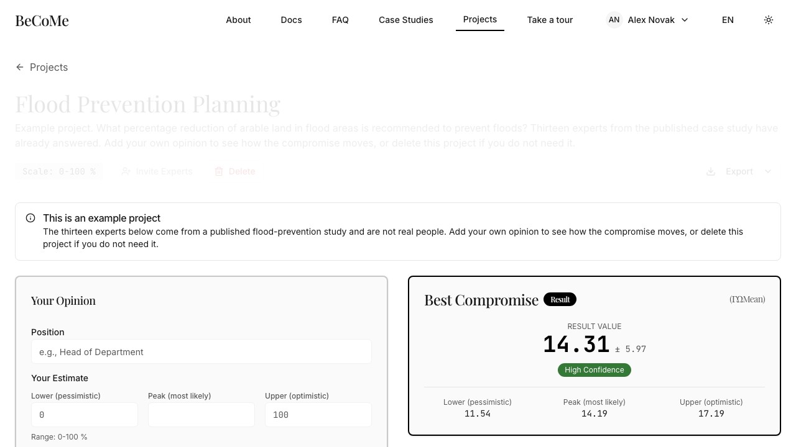

# Running a decision

An expert answers your question with three numbers instead of one. That is the whole idea, and
everything on this page follows from it.

## Why three numbers

Ask someone for a budget figure and they will give you one, because you asked for one. Ask them how
confident they are and they will tell you something quite different: "around sixty, but it could be
forty, and I would not argue with eighty."

The second answer is the true one. The first threw away the part that matters, which is the width.
An expert who says 60 with a range of 40 to 80 and an expert who says 60 with a range of 58 to 62
have said different things, and a method that averages single numbers cannot hear the difference.

An opinion here has three components. The **lower** bound is the pessimistic end of what is
realistic, the **peak** is the single most likely value, and the **upper** bound is the optimistic
end. They must satisfy `lower ≤ peak ≤ upper`, and the form will refuse anything else.

## The three ways to answer

**A fuzzy triangular number** is the normal case, and the one to reach for by default. Enter three
different values: `(40, 60, 80)` says "sixty, and I would accept anything from forty to eighty".

Widening your range does not weaken your vote, which is worth saying because most people assume the
opposite. Take a panel of four and vary only the fourth opinion's width, keeping its peak at 60:

| Fourth opinion | Compromise | Center |
|---|---|---|
| `(58, 60, 62)` | `(38.50, 47.50, 56.50)` | 47.50 |
| `(40, 60, 80)` | `(33.75, 47.50, 61.25)` | 47.50 |
| `(20, 60, 100)` | `(26.25, 47.50, 68.75)` | 47.50 |

The center does not move. What changes is the width of the answer: an honest range makes the
group's uncertainty visible instead of hiding it. So state the range you actually believe. You are
not spending influence by admitting doubt.

**A crisp number** is for the expert who is genuinely certain. Enter the same value three times:
`(50, 50, 50)`. It is a triangle with no width, and the method treats it as one. Do not use it to
mean "I do not want to think about the range". A false certainty carries more weight than it has
earned.

**A Likert answer** is for agreement rather than quantity. When the project scale runs from 0 to
100 with the unit left blank, the answers are read as positions on an agreement scale:

| Position | Value |
|---|---|
| Strongly disagree | 0 |
| Rather disagree | 25 |
| Neutral | 50 |
| Rather agree | 75 |
| Strongly agree | 100 |

You still answer with three numbers. An expert who rather agrees but holds it loosely might enter
`(60, 75, 90)`. The result then comes back as a verdict in words rather than a bare figure, because
"the panel rather agrees" is what the question asked for and 71.4 is not.

!!! warning "The unit decides, not the range"

    A project measured in percent also runs from 0 to 100, and it is not an agreement question.
    Only an empty unit makes a scale Likert. This is why the example project, which measures a
    percentage, keeps its `%` and reports a number.

## When the result appears

As soon as there is something to compute. The result updates every time an opinion arrives, so a
half-answered panel gives a real answer for the experts who have answered so far.

That is worth using rather than waiting out. If the compromise swings hard when the fourth expert
answers, you have learned something about your panel that the final number will hide.

Next: [reading the result](reading-the-result.md).
