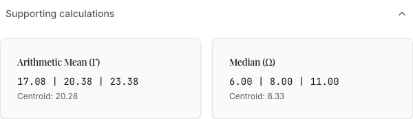
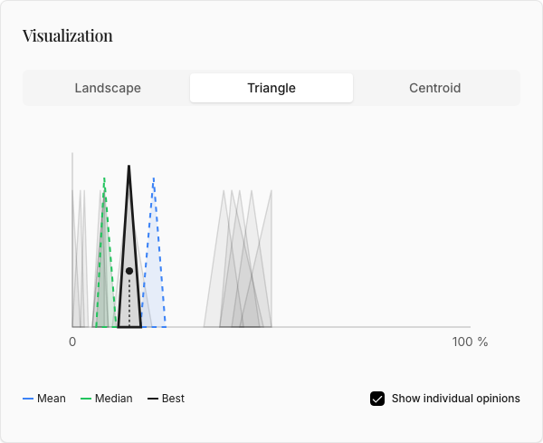

# A worked example

This is the example project sitting in your account, and it is a real one. Thirteen Czech experts
were asked a question about flood prevention, and they did not agree. Working through what BeCoMe
did with that disagreement explains the method better than any invented case, because the numbers
here are genuinely awkward.

## Contents

- [The question](#the-question)
- [What the method returned](#what-the-method-returned)
- [Why the mean and the median disagree so badly](#why-the-mean-and-the-median-disagree-so-badly)
- [What Δmax is telling you](#what-δmax-is-telling-you)
- [What to say when you quote it](#what-to-say-when-you-quote-it)
- [Reproducing it](#reproducing-it)

## The question

**What percentage reduction of arable land in flood areas is recommended to prevent floods?**

The scale runs from 0 to 100 with the unit `%`. Thirteen experts answered.

| Expert | Lower | Peak | Upper |
|---|---|---|---|
| Hydrologist 1 | 37 | 42 | 47 |
| Hydrologist 2 | 42 | 50 | 50 |
| Nature protection | 5 | 7 | 9 |
| Risk management | 37 | 40 | 48 |
| Land use | 6 | 8 | 11 |
| Civil service | 5 | 8 | 9 |
| Municipality 1 | 33 | 38 | 43 |
| Municipality 2 | 5 | 8 | 8 |
| Economist | 10 | 14 | 20 |
| Rescue coordinator | 40 | 45 | 50 |
| Land owner 1 | 2 | 3 | 4 |
| Land owner 2 | 0 | 0 | 2 |
| Land owner 3 | 0 | 2 | 3 |

Read the column of peaks and the panel splits in two. Five of them, the two hydrologists, risk
management, the rescue coordinator and one municipality, want 38 to 50 percent. The land owners, whose fields those
would be, say 0 to 3. Nobody is being unreasonable and nobody is near the middle. There is no
opinion at 25.

## What the method returned

| | Fuzzy number | Center |
|---|---|---|
| Arithmetic mean (Γ) | `(17.08, 20.38, 23.38)` | 20.28 |
| Median (Ω) | `(6.00, 8.00, 11.00)` | 8.33 |
| **Best compromise (ΓΩMean)** | **`(11.54, 14.19, 17.19)`** | **14.31** |
| Maximum error (Δmax) | | 5.97 |

## Why the mean and the median disagree so badly

They answer different questions about the same panel.

The mean counts everyone, so the five experts arguing for 38 to 50 pull it up to 20.28. The median
sorts the thirteen opinions by center and takes the seventh, and because eight of the thirteen sit
below 15, the seventh is one of the low ones: 8.33.

One figure is two and a half times the other. Neither is wrong. The mean is right that a large,
credentialed minority wants a big reduction. The median is right that most of the panel does not.
A method that reported only one of them would be hiding half the evidence.

The compromise sits exactly halfway between them, component by component:

```
lower   (17.08 + 6.00) / 2 = 11.54
peak    (20.38 + 8.00) / 2 = 14.19
upper   (23.38 + 11.00) / 2 = 17.19
```

That is the whole of ΓΩMean. It refuses to choose between counting everyone and ignoring the
extremes, and takes both.

The app shows the same arithmetic under **Supporting calculations**, so the numbers above are not
something you have to take on trust from this page.



## What Δmax is telling you

Δmax is `|20.28 − 8.33| / 2`, which is 5.97. Because the compromise is the midpoint, that same
number is how far it sits from each of the two candidates, and exactly the same on both sides:
5.9733 to the mean and 5.9733 to the median.

Work that out from the rounded figures on this page and you get 5.97 one way and 5.98 the other,
which is an artefact of the rounding rather than a real asymmetry. It is the same trap the rest of
this page is about, and it caught the first draft of this paragraph.

So Δmax is not a margin of error in the usual sense. It is the price of the disagreement, measured
as the distance you had to travel from either honest answer to reach the compromise.

And here is the trap this panel was made for. The app divides Δmax by the width of the scale, and
5.97 on a scale of 0 to 100 is six percent, which it labels **high agreement** in green. That label
is correct by its own rule and the rule is a reasonable one. The panel is still split into two
camps forty points apart.

Both things are true because Δmax does not measure how spread out the panel is. It measures how
far apart the mean and the median landed, and on a two-camp panel those two can end up close: the
mean settles between the camps, the median settles inside the larger one. Six points apart on a
hundred-point scale is not much. Two camps at 2 and at 43 is a great deal.

Never read the badge without looking at the chart underneath it. With every opinion drawn, the
argument takes one glance: the grey triangles stand in two clusters with a gap between them, and
all three aggregate curves sit inside the left one.



## What to say when you quote it

Quote 14.31 percent on its own and you imply a panel that broadly settled around fourteen. It did
not. Exactly one of the thirteen is anywhere near that figure: the economist, whose peak is 14 and
whose range is the only one on the list containing 14.31. Every other opinion sits in one camp or
the other, and 14.31 falls in the gap between them.

So the answer to this question is not "14.31 percent". It is "14.31 percent, from a panel that
split into two camps roughly 40 percent apart, and here is the chart".

## Reproducing it

The data and the analysis live in the repository, so you can run this yourself:

```bash
uv run python -m examples.analyze_floods_case
```

It prints the same four figures and a different verdict: **low agreement**, where the application
says high. Neither is a bug in the arithmetic. The script compares Δmax against fixed thresholds,
the application divides it by the width of the scale first, and on a 0 to 100 scale those two rules
disagree about 5.97. Which rule is the better one is an open question, tracked as BCM-66. For
reading this page, take the numbers from either and the label from neither.

The raw opinions are in `examples/data/floods_case.txt`, and two further cases sit beside it: a
budget allocation and a commuter study. The
[method description](../method-description.md) works through the same arithmetic step by step.
