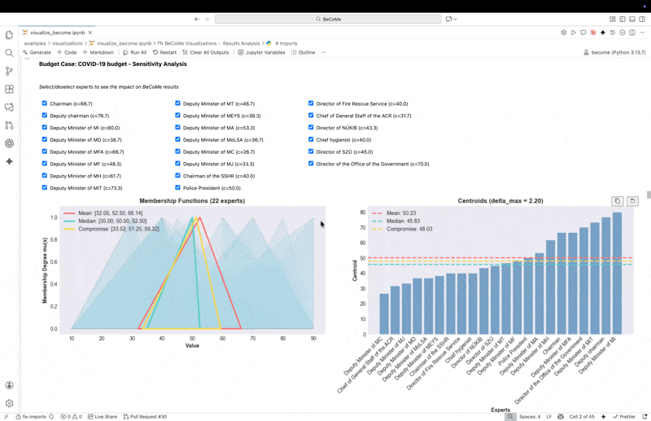

# BeCoMe Visualizations

This directory contains interactive visualization tools for exploring BeCoMe (Best Compromise Method) results. These visualizations are part of a bachelor thesis at the Faculty of Economics and Management, Czech University of Life Sciences Prague.

## Overview

The visualization module provides interactive charts and dashboards for analyzing expert opinions and BeCoMe calculation results. All visualizations run locally in Jupyter environment, allowing dynamic exploration of the data.

## Interactive Demo



*Note: Add a GIF demonstrating the interactive visualizations. The demo should show the main dashboard with expert opinions, centroid comparisons, and sensitivity analysis features.*

## Available Visualizations

The `visualize_become.py` script provides five types of interactive visualizations:

### 1. Triangular Membership Functions
Display expert opinions as fuzzy triangular numbers with membership functions showing the degree of membership for each value in the triangular fuzzy number representation. This visualization overlays the arithmetic mean (Gamma), median (Omega), and best compromise (GammaOmegaMean) on top of all expert triangular opinions.

### 2. Centroid Charts
Comparative visualization of expert centroids alongside aggregated metrics (arithmetic mean, median, and best compromise), facilitating assessment of consensus and outliers. Each expert's fuzzy opinion is reduced to a single representative centroid value and sorted for easy comparison.

### 3. Interactive Sensitivity Analysis
Dynamic tool for exploring the impact of including or excluding specific experts on the final best compromise result. Allows real-time recalculation and visualization of changes through interactive checkboxes. This widget provides immediate feedback on how removing outliers affects the consensus estimate.

### 4. Scenario Dashboard
Comparative overview displaying all three case studies (Budget, Floods, Pendlers) side-by-side in a single integrated view. Combines a detailed metrics table with compact visual charts, enabling rapid cross-scenario analysis and pattern identification across different expert opinion structures.

### 5. Accuracy Gauge Indicator
Visual quality assessment showing the agreement level among experts and the precision of the consensus estimate (based on maximum error metric). Displays results as a speedometer-style gauge combined with a horizontal bar chart, using color coding (green/yellow/red) for instant quality assessment.

## Usage

### Requirements

Ensure Jupyter environment is installed:

```bash
uv sync
# or
pip install -e ".[dev]"
```

### Running Visualizations

Open the visualization script in Jupyter Notebook:

```bash
jupyter notebook examples/visualizations/visualize_become.py
```

Or use JupyterLab for enhanced interface:

```bash
jupyter lab examples/visualizations/visualize_become.py
```

### Interactive Features

All visualizations support:
- **Zoom and pan** - Explore specific regions of the charts
- **Hover tooltips** - Display detailed information for each data point
- **Dynamic filtering** - Select/deselect experts to see impact on results
- **Real-time recalculation** - Interactive sensitivity analysis updates immediately

These features run entirely in the local browser environment without requiring external services.

## Output

### Automatic Saving

All generated visualizations are automatically saved to:

```
examples/visualizations/output/
```

Output files include:
- PNG images for static inclusion in reports
- Interactive HTML files for web-based exploration
- Data exports in CSV format (when applicable)

### File Naming Convention

Files are named according to the pattern:
```
{case_name}_{visualization_type}_{timestamp}.{extension}
```

Example: `budget_triangular_functions_20250122.png`

## Case Studies

The visualizations support all three case studies included in the thesis:

1. **Budget Case** - COVID-19 budget allocation (22 experts, even)
2. **Floods Case** - Flood prevention planning (13 experts, odd)
3. **Pendlers Case** - Cross-border travel policy (22 experts, Likert scale)

Each case demonstrates different characteristics of expert opinion aggregation under fuzzy uncertainty.

## Technical Details

### Visualization Libraries

The implementation uses:
- **Matplotlib** - Base plotting functionality
- **Seaborn** - Statistical visualizations and styling
- **ipywidgets** - Interactive controls for Jupyter environment
- **NumPy/Pandas** - Data processing and manipulation

### Performance

All visualizations are optimized for local execution:
- Efficient rendering of large expert datasets (tested up to 100+ experts)
- Responsive interactive controls with minimal latency
- Memory-efficient handling of multiple simultaneous visualizations

## References

For more information:
- **Mathematical foundation**: See `../../docs/method-description.md`
- **Example case studies**: See `../README.md`
- **Implementation details**: See source code in `visualize_become.py`

## Notes

- All visualizations are designed for academic presentation and thesis documentation
- Color schemes are optimized for both screen display and print reproduction
- Interactive features require Jupyter environment; static exports available for offline use
