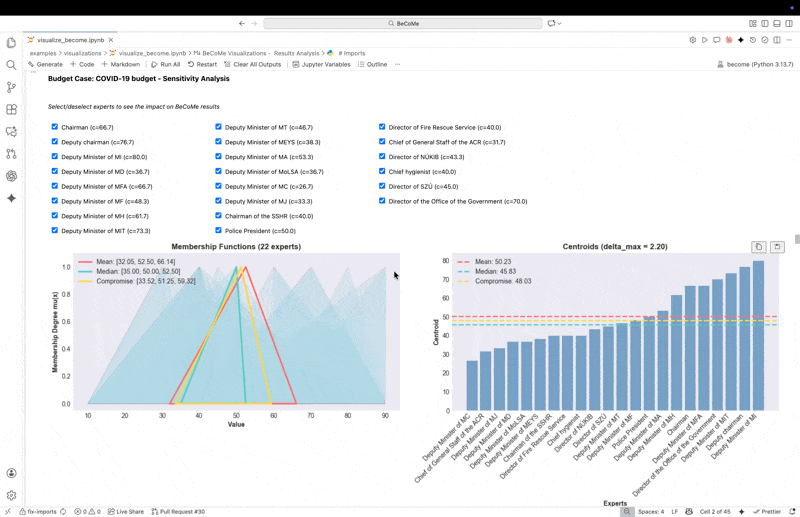

# BeCoMe visualizations

Interactive Jupyter charts for exploring expert opinions and BeCoMe calculation results.
Everything runs locally and needs no external services.

## Interactive demo



*Expert opinions, centroid comparisons, and sensitivity analysis in action.*

## Available visualizations

**Triangular membership functions.** Expert opinions appear as overlapping triangular fuzzy
numbers, with the arithmetic mean (Γ), the median (Ω), and the best compromise (ΓΩMean) drawn
on top.

**Centroid charts.** Each expert's fuzzy opinion collapses to a single centroid value, sorted
and compared against the aggregated metrics. Useful for spotting outliers.

**Sensitivity analysis.** Toggle individual experts on and off with checkboxes to see how their
inclusion affects the final compromise. The chart recalculates in real time.

**Scenario dashboard.** All three case studies (Budget, Floods, Pendlers) side by side, with a
metrics table and compact charts for cross-case comparison.

**Accuracy gauge.** A speedometer-style indicator of how far the experts agree, color-coded
green, yellow, or red from the maximum error metric.

## Running

```bash
jupyter notebook examples/visualizations/visualize_become.ipynb
# or
jupyter lab examples/visualizations/visualize_become.ipynb
```

Requires a Jupyter environment (`uv sync` installs all dependencies).

## Interactive features

Charts support zoom, pan, and hover tooltips. The sensitivity analysis updates as soon as you
toggle an expert. Everything runs in the browser, with no server calls.

## Technical details

Built with Matplotlib, Seaborn, NumPy, and ipywidgets.

## Related documentation

- [examples/README.md](../README.md): case study analyses
- [data/README.md](../data/README.md): dataset documentation
- [docs/method-description.md](../../docs/method-description.md): mathematical foundation
